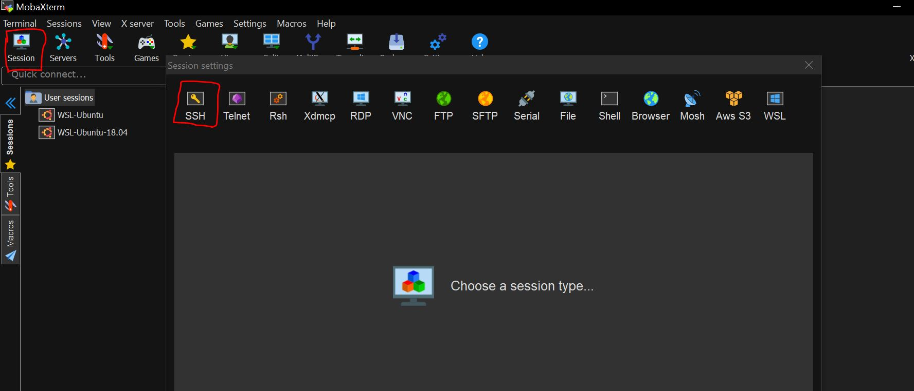
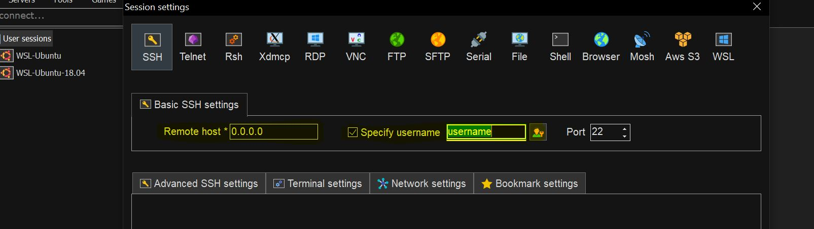

# How to use `ssh` command
The following requirements should be met before using ssh
- SSH server must be running on remote machine
- Remote account username and password should be known
- SSH port must be open in remote machine (The standard port is 22)  

*Example:*
```
$ ssh username@remoteAddress 
$ ssh test@10.1.8.23 (provided this info, the command asks for confirmation, once confirmed ,the password of remote account is entered and then you will be in remote terminal)
```

## SSH config file
When dealing with multiple ssh machines, remembering all the IP addresses becomes a problem.Then there comes the option of storing different ssh options for remote machines.  
This can be done from `~/.ssh/config` file.  

*Example:*
```
Host remote1
    HostName adc
    User usr1
    IP address 10.0.0.9
    Port 4420
Host remote2
    HostName trd
    User usr2
    IP address 10.0.1.9
    Port 4420
    
$ ssh remote1 (this is similar to adc@10.0.0.9)
$ ssh remote2 (this is similar to trd@10.0.1.9)
```
# SSH-Client for Windows
Persoanlly experienced with MobaXterm X-server. Mobaxterm is the good and enhanced SSH client for windows with many tools for remote connections.  
ssh connections to remote machines can be done easily with this client. Other remote Connections like Telnet,VNC,RDP,FDP.
Mobaxterm can be downloaded from:
-[MobaXterm Download](https://mobaxterm.mobatek.net/download-home-edition.html)
The different connections can be made as following:
1. Click on session, once you click it will popu another window ,wherein you can see the different remote connections.
2. Click on ssh connection.



3. Once clicked on SSH , you can provide the IP address and username and click OK.




